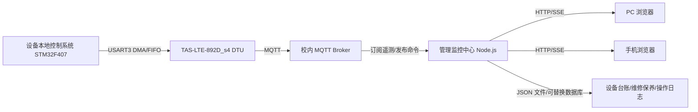
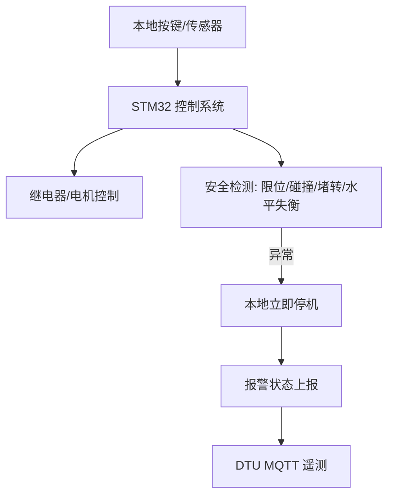
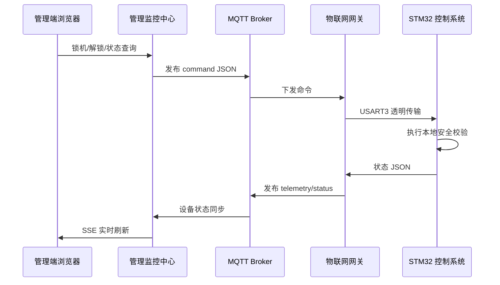

# 系统架构图说明

## 1. 总体架构

```mermaid
flowchart LR
    A[设备本地控制系统 STM32F407] -->|USART3 DMA/FIFO| B[TAS-LTE-892D_s4 DTU]
    B -->|MQTT| C[校内 MQTT Broker]
    C -->|订阅遥测/发布命令| D[管理监控中心 Node.js]
    D -->|HTTP/SSE| E[PC 浏览器]
    D -->|HTTP/SSE| F[手机浏览器]
    D -->|JSON 文件/可替换数据库| G[设备台账/维修保养/操作日志]
```

## 2. 设备侧闭环

```mermaid
flowchart TD
    K[本地按键/传感器] --> C[STM32 控制系统]
    C --> M[继电器/电机控制]
    C --> S[安全检测: 限位/碰撞/堵转/水平失衡]
    S -->|异常| STOP[本地立即停机]
    STOP --> ALARM[报警状态上报]
    ALARM --> MQTT[DTU MQTT 遥测]
```

## 3. 远程管理闭环

```mermaid
sequenceDiagram
    participant Web as 管理端浏览器
    participant Server as 管理监控中心
    participant Broker as MQTT Broker
    participant DTU as 物联网网关
    participant MCU as STM32 控制系统

    Web->>Server: 锁机/解锁/状态查询
    Server->>Broker: 发布 command JSON
    Broker->>DTU: 下发命令
    DTU->>MCU: USART3 透明传输
    MCU->>MCU: 执行本地安全校验
    MCU->>DTU: 状态 JSON
    DTU->>Broker: 发布 telemetry/status
    Broker->>Server: 设备状态同步
    Server->>Web: SSE 实时刷新
```

## 4. 私有化部署

学校内网部署时，MQTT Broker、管理监控中心和浏览器访问均运行在校内网络。若需要校外访问，可通过 VPN、专线、反向代理或云端转发扩展，但账号权限和操作日志仍由管理监控中心统一记录。
